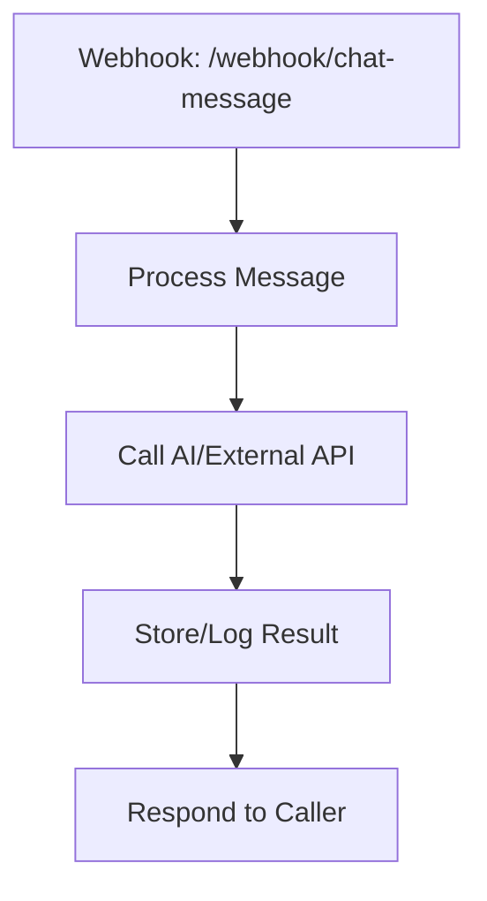

# Chat Flow and n8n Webhook Integration

## 1. Introduction

This document provides a step-by-step overview of the chat flow in the Multi-Modal Chat project, detailing all functional components involved in message processing, and explains how n8n webhook processing could be integrated. It is intended for developers seeking to understand or extend the chat system, including multi-modal and external workflow (n8n) support.

---

## 2. End-to-End Chat Flow (Current Implementation)

### **Step 1: User Interaction (Frontend)**

- **Component:** `components/chat/ChatComponent.tsx`
- **Role:** Handles user input, file uploads, and message submission.
- **Key Logic:**

```tsx
const { messages, input, handleInputChange, handleSubmit, isLoading, setMessages } = useChat({
  api: "/api/chat",
  body: { chatId: currentChat?.id },
  initialMessages: currentChat?.messages || [],
  onFinish: async (message) => { /* Save assistant message */ },
  onError: (error) => { /* Error handling */ },
});
```

- **File Handling:** Drag-and-drop, paste, and file input are supported for images and text files.

### **Step 2: API Request (Backend)**

- **Route:** `app/api/chat/route.ts`
- **Role:** Receives chat messages, saves user message, streams AI response, saves assistant message.
- **Key Logic:**

```ts
export async function POST(req: Request) {
  const { messages, chatId } = await req.json();
  // Save user message, update title if first message
  // Stream AI response and save assistant message
  // (see addMessageToChat in lib/chat.ts)
}
```

### **Step 3: Message Persistence**

- **Library:** `lib/chat.ts`
- **Role:** Handles chat creation, message storage, retrieval, and updating chat metadata in Vercel KV.
- **Key Logic:**

```ts
export async function addMessageToChat(chatId: string, message: Message): Promise<void> {
  const chat = await getChat(chatId);
  if (!chat) return;
  const messages = [...chat.messages, message];
  await kv.hset(`chat:${chatId}`, { messages });
  await kv.zadd('chats', { score: Date.now(), member: `chat:${chatId}` });
}
```

### **Step 4: UI Update**

- **Component:** `ChatComponent.tsx` (and context)
- **Role:** Updates UI with new messages and attachments after backend processing.

---

## 3. Component Breakdown

### **A. ChatComponent.tsx**

- Handles user input, file uploads, and message rendering.
- Calls `/api/chat` for message processing.
- Handles drag-and-drop, paste, and file input for attachments.

### **B. API Routes**

- `/api/chat`: Main entry for chat messages and AI streaming.
- `/api/chats/[id]/messages`: Persists individual messages to a chat.

### **C. lib/chat.ts**

- Data management: chat creation, message storage, retrieval, and metadata updates.

---

## 4. Example Data Flow Diagram

```mermaid
graph TD
  A[User Input (ChatComponent)] --> B[POST /api/chat]
  B --> C[API Route: /api/chat/route.ts]
  C --> D[lib/chat.ts: addMessageToChat]
  D --> E[Vercel KV Storage]
  C --> F[AI Streaming Response]
  F --> A
```

---

## 5. n8n Webhook Integration (Template)

> **Note:** n8n integration is not currently implemented. This section provides a template for future integration.

### **A. n8n Webhook Workflow**

- Create a Webhook node in n8n (e.g., POST `/webhook/chat-message`).
- Add processing nodes (filter, transform, call external APIs, etc.).
- Optionally, call your chat API or store messages.
- End with a Response node.

#### **Workflow Diagram**



### **B. Example: Calling n8n Webhook from Next.js API Route**

```ts
// In app/api/chat/route.ts
export async function POST(req: Request) {
  const { messages, chatId } = await req.json();
  // Call n8n webhook
  const n8nResponse = await fetch('https://your-n8n-instance/webhook/chat-message', {
    method: 'POST',
    headers: { 'Content-Type': 'application/json' },
    body: JSON.stringify({ messages, chatId }),
  });
  const result = await n8nResponse.json();
  // Optionally, process result and store in your DB
  return new Response(JSON.stringify(result), { status: 200 });
}
```

### **C. Consolidated Flow with n8n**

- Chat UI sends messages to Next.js API route.
- API route forwards message to n8n webhook.
- n8n processes the message (enrich, moderate, call AI, etc.).
- n8n responds with the result, which is returned to the frontend.
- Optionally, store the result in your database or trigger further actions.

---

## 6. Summary & Update Instructions

- The above flow covers all major components and data paths for chat processing.
- n8n integration is a template for future extensibility.
- **Update this document** if the chat flow or n8n integration changes, or if new features are added.

---

*For further details, see also: `chatFunction.md` and related files in the memory bank.*

---

## 7. Minimal-File n8n Webhook Flow Example (with Attachments)

This section demonstrates how to implement the n8n webhook chat flow—including file/attachment handling—using the fewest files possible, based on best practices. The example adapts the typical `@page.tsx` and `@route.ts` structure, leveraging Vercel's AI SDK features.

### **A. Frontend: Single-File Chat UI (`app/page.tsx` or similar)**

```tsx
'use client';
import { useChat } from '@ai-sdk/react';
import { useRef, useState } from 'react';

export default function Page() {
  const { messages, input, handleInputChange, handleSubmit, status } = useChat();
  const [files, setFiles] = useState<FileList | undefined>(undefined);
  const fileInputRef = useRef<HTMLInputElement>(null);

  return (
    <div>
      <div>
        {messages.map(message => (
          <div key={message.id}>
            <div>{`${message.role}: `}</div>
            <div>{message.content}</div>
            <div>
              {message.experimental_attachments?.map((attachment, idx) => (
                attachment.contentType?.startsWith('image/') ? (
                  
                ) : (
                  <a key={idx} href={attachment.url} download={attachment.name}>{attachment.name}</a>
                )
              ))}
            </div>
          </div>
        ))}
      </div>
      <form
        onSubmit={event => {
          handleSubmit(event, { experimental_attachments: files });
          setFiles(undefined);
          if (fileInputRef.current) fileInputRef.current.value = '';
        }}
      >
        <input
          type="file"
          multiple
          onChange={event => setFiles(event.target.files || undefined)}
          ref={fileInputRef}
        />
        <input
          value={input}
          placeholder="Send message..."
          onChange={handleInputChange}
          disabled={status !== 'ready'}
        />
        <button type="submit">Send</button>
      </form>
    </div>
  );
}
```

- **Key Points:**
  - Uses `useChat` from Vercel AI SDK for state and streaming.
  - Handles file input and passes files as `experimental_attachments`.
  - Renders attachments (images and other files) in the chat UI.

### **B. Backend: Single-File API Route with n8n Webhook (`app/api/chat/route.ts`)**

```ts
import { streamText } from 'ai';

export async function POST(req: Request) {
  // Parse the incoming request, including attachments
  const body = await req.json();
  const { messages, experimental_attachments } = body;

  // Forward the message and attachments to n8n webhook
  const n8nResponse = await fetch('https://your-n8n-instance/webhook/chat-message', {
    method: 'POST',
    headers: { 'Content-Type': 'application/json' },
    body: JSON.stringify({ messages, experimental_attachments }),
  });
  const n8nResult = await n8nResponse.json();

  // Optionally, stream the AI response using Vercel AI SDK
  // (or just return n8n's result if n8n handles the AI call)
  // Here, we assume n8n returns a 'messages' array for streaming
  const result = streamText({
    model: {
      // You can use a custom provider or just return n8nResult.messages
      // For demo, we use n8nResult.messages as the AI response
      async call() { return { messages: n8nResult.messages }; },
    },
    messages,
  });
  return result.toDataStreamResponse();
}
```

- **Key Points:**
  - Receives both messages and attachments from the frontend.
  - Forwards them to the n8n webhook as JSON (n8n can process attachments as Data URLs or base64 strings).
  - Streams the AI response back to the client (or just returns n8n's result).

### **C. n8n Webhook (Example Node Setup)**

- n8n receives the POST payload with `messages` and `experimental_attachments`.
- n8n can process attachments (e.g., save to storage, analyze, or forward to another API).
- n8n returns a response with a `messages` array (or any structure your app expects).

#### **n8n Webhook Node Example (JSON Input):**

```json
{
  "messages": [ ... ],
  "experimental_attachments": [
    {
      "name": "file.txt",
      "contentType": "text/plain",
      "url": "data:text/plain;base64,SGVsbG8gd29ybGQh"
    },
    {
      "name": "image.png",
      "contentType": "image/png",
      "url": "data:image/png;base64,iVBORw0KGgo..."
    }
  ]
}
```

- n8n can decode the Data URLs for further processing.

### **D. Best Practices for Minimal, Maintainable Code**

- Keep all chat logic in a single API route and a single page/component where possible.
- Use Vercel's `useChat` and `streamText` for state, streaming, and attachments.
- Pass files as Data URLs or base64 strings for easy transport through webhooks.
- Document the expected payload structure for n8n and your API.
- If you need persistence, add a simple utility or hook for saving/loading messages (can be a single helper file).

### **E. Enhancing with Vercel AI SDK Features**

- Use `onFinish`, `onError`, and `onResponse` callbacks in `useChat` for advanced UX.
- Use `experimental_attachments` for multi-modal support.
- Use `sendExtraMessageFields` if you want to pass extra fields (like timestamps or IDs) to the backend.
- Use `experimental_prepareRequestBody` to customize the request payload if needed.

---

**This example demonstrates a minimal, production-ready n8n chat flow with file support, using only two main files. Adapt as needed for your project structure.**
